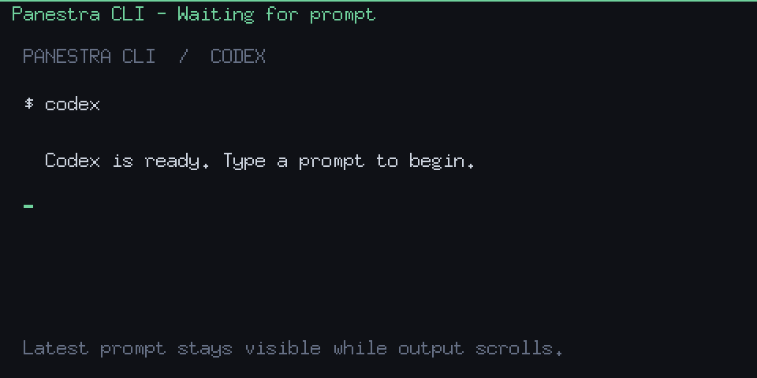

# Panestra CLI

Panestra CLI is the lightweight, terminal-native edition of [Panestra](https://github.com/fru180/Panestra).

It keeps the latest prompt visible at the top of your terminal while Codex CLI or Claude Code is running, without requiring the Panestra web dashboard.

Panestra CLIは、Panestraの軽量なターミナル版です。Panestra Webを起動せず、Codex CLIやClaude Codeへ送信した最新の指示をターミナル上部へ固定表示します。

```text
┌ Task: 認証処理をリファクタリングしてください ──────────────────────┐
│ Codex / Claude Code                                                 │
│ エージェントの応答や実行ログ                                       │
```



## Requirements

- macOS（Apple Silicon / Intel）
- zsh
- tmux
- Codex CLI または Claude Code

## Installation

正式リリースでは Homebrew を使用します。

```bash
brew install fru180/tap/panestra-cli
panestra setup
source ~/.zshrc
panestra doctor
```

ソースから試す場合:

```bash
git clone https://github.com/fru180/Panestra-cli.git
cd Panestra-cli
./scripts/install.sh
panestra setup
source ~/.zshrc
```

セットアップ後も、通常どおり起動します。

```bash
codex
claude
```

対話セッションだけが自動的に tmux 内で起動します。`codex exec`、`codex review`、`claude -p`、`--help`、`--version`、パイプ入力などの非対話利用はそのまま実行されます。

## Commands

```text
panestra setup       shim・PATH・エージェントフックを導入
panestra doctor      導入状態を診断
panestra enable      有効化
panestra disable     継続的に無効化
panestra clear       現在のペインの表示を消去
panestra uninstall   Panestra CLI が追加した設定を削除
panestra version     バージョンを表示
```

1回だけ無効化するには `PANESTRA_CLI_DISABLE=1 codex` を使用します。

設定は `~/.config/panestra-cli/config.toml` にあります。

```toml
enabled = true
auto_tmux = true
prefix = "Task: "
max_width = 120
show_waiting_message = true
```

環境変数 `PANESTRA_CLI_DISABLE`、`PANESTRA_CLI_MAX_WIDTH`、`PANESTRA_CLI_PREFIX`、`PANESTRA_CLI_DEBUG` で上書きできます。

## Privacy

Panestra CLI はプロンプトをファイルへ保存せず、外部通信やテレメトリーを行いません。最新プロンプトは tmux のペインオプションにだけ一時保持され、セッション終了時に消去されます。

> Panestra CLI displays your latest prompt on screen. Prompts may be visible during screen sharing or recording.

詳しい導入方法は [Installation](docs/installation.md)、設計は [Architecture](docs/architecture.md)、問題の切り分けは [Troubleshooting](docs/troubleshooting.md)、要件ごとの検証状況は [Requirements Audit](docs/requirements-audit.md) を参照してください。

## Development

```bash
go test ./...
go vet ./...
gofmt -w cmd internal scripts/generate-demo
```

デモGIFを再生成する場合:

```bash
go run ./scripts/generate-demo
```

MIT License
